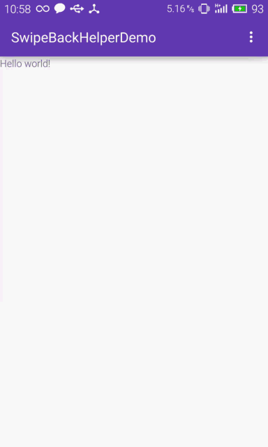

# TySwipLayout
类似微信滑动删除activity,解决由于透明activity所导致的activity之间转场退出动画无效问题，基于SwipeBackHelper源码修改，不依赖透明activity

### 使用方法
#### dependencies {
	        implementation 'com.github.usernamety:TySwipLayout:v1.0.9'
	}
### 解除windowIsTranslucent=true限制
 < item name="android:windowIsTranslucent">false</ item >
##  使用TySwipLayout，你可以将windowIsTranslucent=false，这样就不会与你的windowAnimationStyle发送冲突，从而导致你的转场动画失效

## 1 让你的activity继承TySwipBackActivity
  
   public class MainActivity extends TySwipBackActivity {

          @Override
          protected void onCreate(Bundle savedInstanceState) {
          super.onCreate(savedInstanceState);
          setContentView(R.layout.activity_main);
          SwipeBackHelper.getCurrentPage(this).setSwipeBackEnable(false);
          }
    } 

 ## 2   在你的activity主题样式中添加动画
    
          < item name="android:windowAnimationStyle">@style/TySwipLayoutAnim</ item>
	  
## 手机取不了动图，借用开源框架 SwipeBackHelper 图片说话

## SwipeBackHelper有的功能他都有 在SwipeBackHelper.onCreate() 之后
    
     SwipeBackHelper.getCurrentPage(this)//获取当前页面
     
        .setSwipeBackEnable(true)//设置是否可滑动
	
        .setSwipeEdge(200)//可滑动的范围。px。200表示为左边200px的屏幕
	
        .setSwipeEdgePercent(0.2f)//可滑动的范围。百分比。0.2表示为左边20%的屏幕
	
        .setSwipeSensitivity(0.5f)//对横向滑动手势的敏感程度。0为迟钝 1为敏感
	
        .setScrimColor(Color.BLUE)//底层阴影颜色
	
        .setClosePercent(0.8f)//触发关闭Activity百分比
	
        .setSwipeRelateEnable(false)//是否与下一级activity联动(微信效果)。默认关
	
        .setSwipeRelateOffset(500)//activity联动时的偏移量。默认500px。
	
        .setDisallowInterceptTouchEvent(true)//不抢占事件，默认关（事件将先由子View处理再由滑动关闭处理）
	
        .addListener(new SwipeListener() {//滑动监听

            @Override
            public void onScroll(float percent, int px) {//滑动的百分比与距离
            }

            @Override
            public void onEdgeTouch() {//当开始滑动
            }

            @Override
            public void onScrollToClose() {//当滑动关闭
            }
        });
